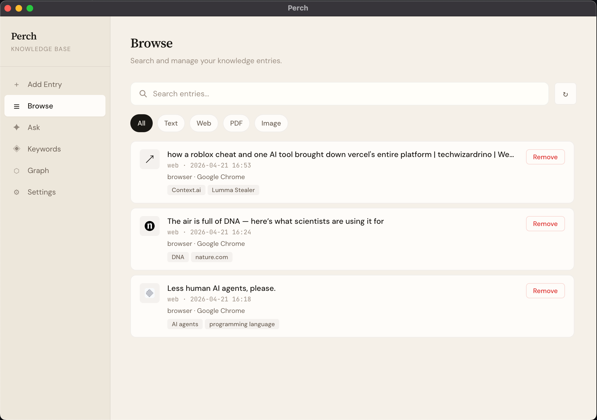
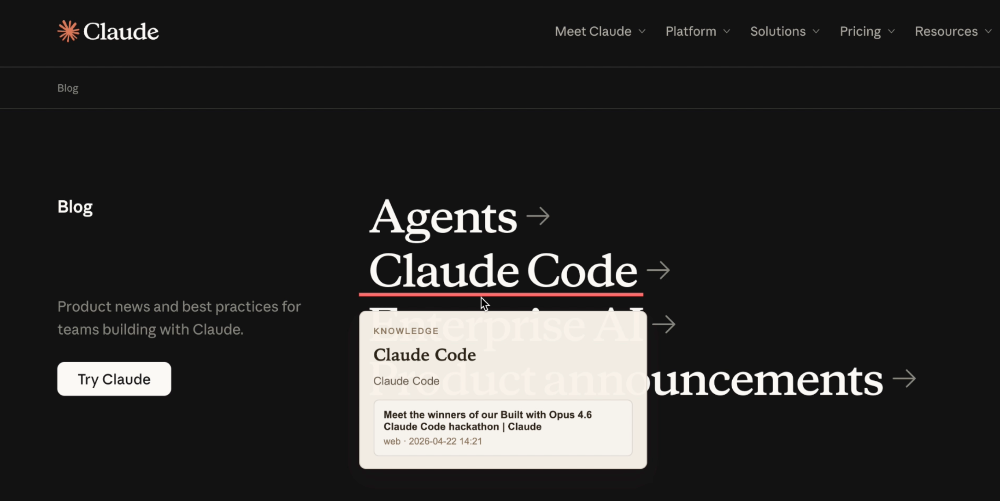
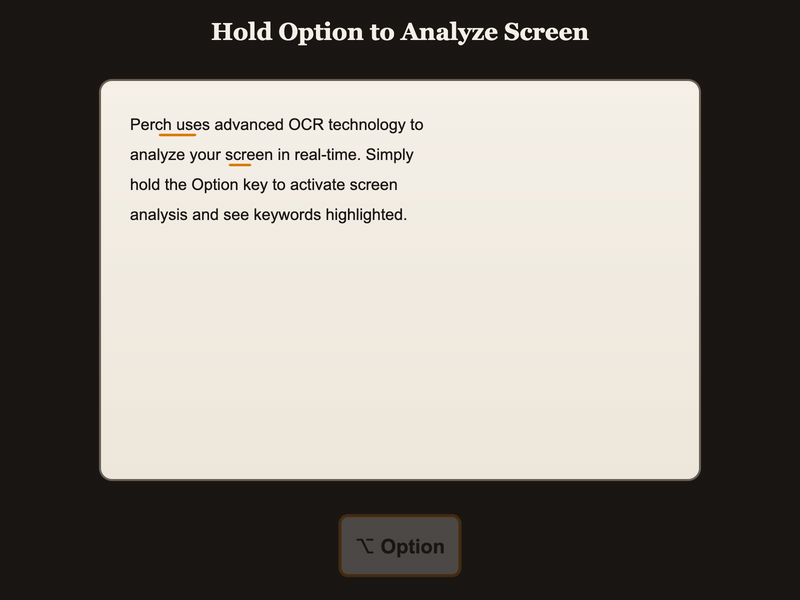
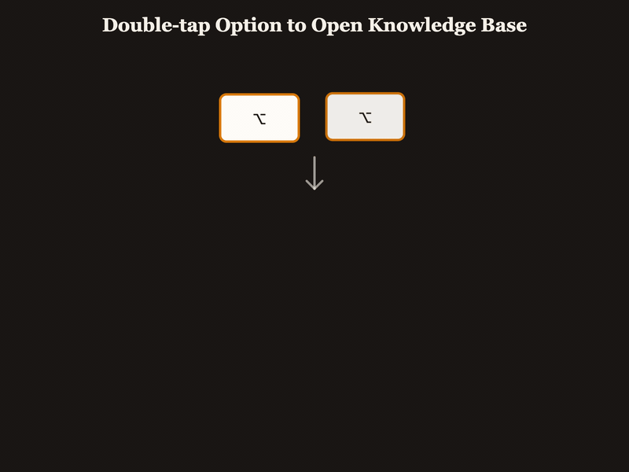
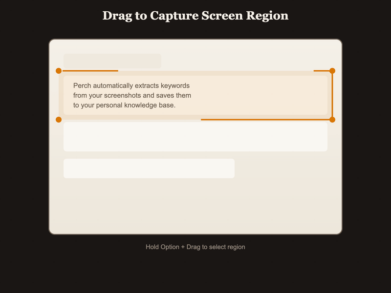

# Perch

<p align="center">
  
</p>

<p align="center">
  Intelligent screen capture and knowledge management for macOS.
</p>




## How It Works

### Hold Option — Analyze Screen

Perch uses native OCR to detect and underline keywords on your screen in real-time.



<p align="center">
  
</p>

### Double-tap Option — Open Knowledge Base

Browse, search, and chat with everything you've captured.

<p align="center">
  
</p>

### Option + Drag — Capture Region

Select any area on screen. Keywords and descriptions are extracted automatically.

<p align="center">
  
</p>

---

## Quick Start

### Download

Download the latest release from [Releases](https://github.com/yourusername/Perch/releases).

**macOS Security Note:** Since the app is not code-signed, macOS Gatekeeper will block it on first launch. To allow it:

```bash
sudo xattr -r -d com.apple.quarantine /Applications/Perch.app
```

Or if you downloaded the DMG:

```bash
sudo xattr -r -d com.apple.quarantine ~/Downloads/Perch-*.dmg
```

### Build from Source

```bash
npm install
npm run build
npm start
```

macOS will prompt for Screen Recording permission on first launch. Grant it in **System Settings > Privacy & Security > Screen Recording**, then restart.

### Requirements

- macOS 10.15+
- Node.js 18+
- [LM Studio](https://lmstudio.ai/) or any OpenAI-compatible endpoint

---

## Usage

| Shortcut | Action |
|----------|--------|
| Hold **⌥ Option** | Analyze screen, highlight keywords |
| Double-tap **⌥ Option** | Toggle knowledge base window |
| **⌥ Option** + Drag | Capture screen region |
| Select text + **⌥ Option** | Save selected text |

## Knowledge Base

- **Browse** — View and search all entries (text, images, PDFs, web pages)
- **Ask** — Chat with an AI agent grounded in your captured content
- **Keywords** — Explore auto-extracted concepts with descriptions
- **Graph** — Visualize connections between keywords and documents
- **Settings** — Configure AI model and API endpoint

---

## Configuration

Data is stored locally in `~/.perch/`. Configure the AI model in the Settings panel or edit `~/.perch/settings.json` directly:

```json
{
  "apiBaseUrl": "http://127.0.0.1:1234/v1",
  "chatModel": "qwen/qwen3.5-9b"
}
```

---

## Development

```bash
npm run dev       # Watch mode
npm run build     # Full build (TS + native module)
npm run package   # Package with electron-builder
```

## Tech Stack

Electron · TypeScript · macOS Vision API · SQLite

## Privacy

Everything runs locally. Your data never leaves your machine unless you point the API endpoint to a remote server.

## License

MIT
